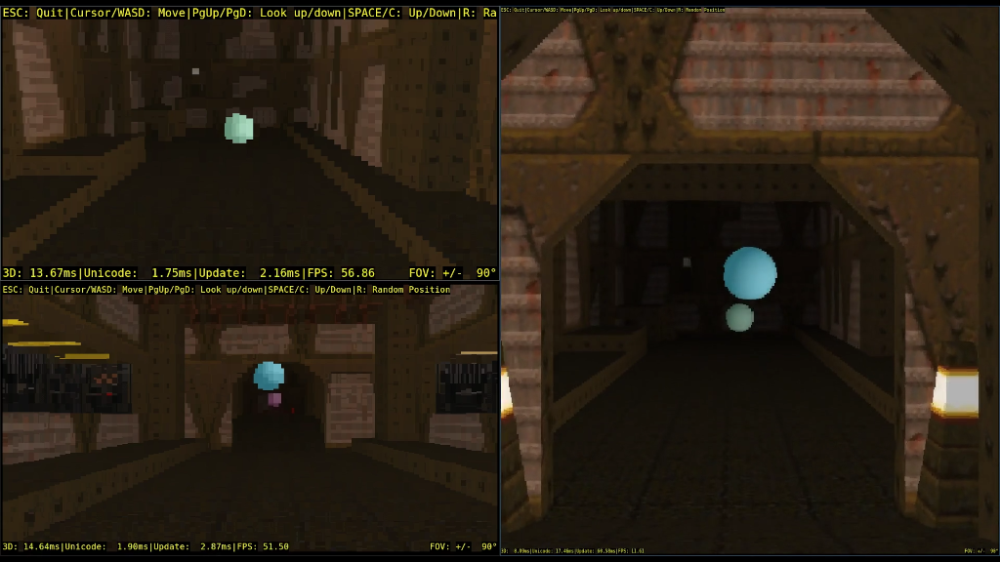

# SSH3D - A small demo SSH server which renders multi-user 3D levels.

Demonstration of a SSH server with does interactive 3D renderings
in the terminal when connected to. Connected clients
can see each other. See a video of it on [YouTube](https://youtu.be/5PbXXZQdPrc).

**We have a [demo server](./docs/demo.md) where you can try it yourself.**




## Build

You need a working Go dev enviroment installed on your system.
[Go 1.19+](https://go.dev/dl/) works fine.

This software was developed and tested under GNU/Linux systems.
Other unixoid systems may work also.
You need a SDL2 library on your system with `offscreen` rendering compiled in.
It's very unlikely that the SDL2 version coming with your distribution does
have it enabled. Therefore we are going to compile it ourselves:

```
export SDL_VERSION=2.28.5

cd $HOME
mkdir -p devel/sdl2/custom
cd devel/sdl2
wget https://github.com/libsdl-org/SDL/releases/download/release-$SDL_VERSION/SDL2-$SDL_VERSION.tar.gz
tar xfz SDL2-$SDL_VERSION.tar.gz
cd SDL2-$SDL_VERSION
./configure --enable-video-offscreen=yes --prefix=$HOME/devel/sdl2/custom
```
If this fails install the missing dependencies reported by configure.
```
make -j$(nproc)
make install
cd ../..
```

`go-sdl2` needs to compile the bindings to SDL2. To prevent
interfering with a possible pre-installed and used SDL2 installation,
clean your Go cache, please.
```
go clean -cache
```

Now you can build the binaries. Don't forget to set the `PKG_CONFIG_PATH` env var:
```
export PKG_CONFIG_PATH=$HOME/devel/sdl2/SDL2-$SDL_VERSION:$PKG_CONFIG_PATH

git clone https://gitlab.com/sascha.l.teichmann/ssh3d.git
cd ssh3d
go build -o bin/ssh3dmulti ./cmd/ssh3dmulti
go build -o bin/x3dmulticlient ./cmd/x3dmulticlient
```

## Data

You need some level data to be rendered:
```
wget https://gitlab.com/sascha.l.teichmann/quake-x3d/-/archive/main/quake-x3d-main.tar.gz
tar xfz quake-x3d-main.tar.gz 
```

## Running

To start the server issue the following:
```
./bin/ssh3dmulti --renderer ./bin/x3dmulticlient -- -log e1m1.log -scene quake-x3d-main/data/e1m1.x3d.gz
```

To connect to the server:
```
ssh -p2222 localhost -o "UserKnownHostsFile /dev/null" -o "StrictHostKeyChecking=no"
```

The `UserKnownHostsFile` and `StrictHostKeyChecking` options are only used to not take
the temporary SSH server too seriously.

# License

Copyright 2021, 2022 by Sascha L. Teichmann.

This software is licensed by the terms of the MIT [license](LICENSE).
